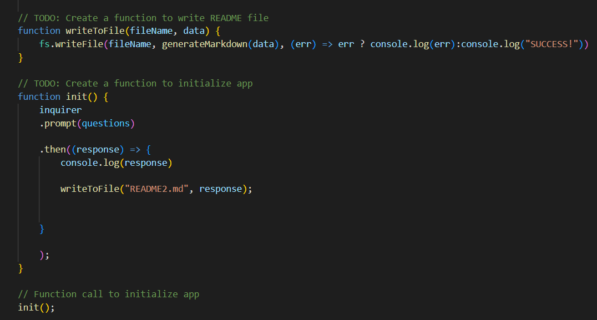

# README Generator 
  
  [](https://opensource.org/licenses/MIT)

  #Table of Content
  -[description](#Description)
  -[installation](#Installation)
  -[usage](#Usage)
  -[credits](#Credits)
  -[license](#License)
  -[contact](#Contact)

  ## Description:
  The purpose behind this project was to create a generator for README's. That way developing README's can be done with ease. Also now I can be prompted with everything I need in my read me, so I do not forget to include anything. 

  You can see this project in action below:

  


  ## Installation:
  In order to be able to utilize this generator within your command line, you would have to install node.js and also npm inquirer package. Npm inquirer package allows for prompts to be displayed to you within the command line. 

  Below, I have displayed how I utilized inquirer to prompt questions within the command line:

   

  ## Usage:
  You will be prompted with questions inside the command line that cover the material that should be included in your README. You can either answer the question or leave it blank to move on to the next question. Your answers to the questions will then be generated below the correct section of your README. You can naviagte to the section you would like by hovering over it in the Table of Contents and clicking the link. This will simply move you the the designated area you choose to be in. Now you can either use this to generate your entire README or have it set up some base for you so you can modify it later if you like. 
  
  Here you can see how I have used the writeToFile function to generate the README2.md file. In order to do this I needed to use nodes file system to write to the file. 
  You can do this easily by using: 
  ```
  fs.writeFile
  ```
  
  


  ## Credits:
  None, at the moment but here's a useful link on how to develop high quality README's that was provided to me by my instructor:
  https://coding-boot-camp.github.io/full-stack/github/professional-readme-guide
  I utilized https://gist.github.com/lukas-h/2a5d00690736b4c3a7ba to generate markdown license badges.

 
  ## License:
  MIT 

  ## Contact:
  allleizq@gmail.com
